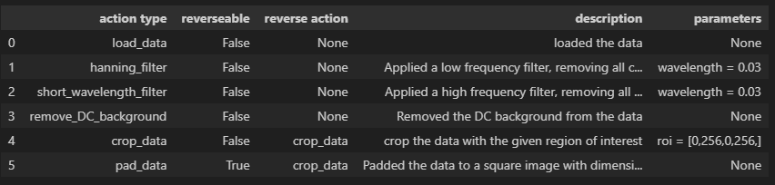

#  Magnetic field reconstruction

Magrec is a package for the reconstruction of the source quantity from the measured magnetic field. 
The source quantity can be the magnetisation or the current density in 2 dimensions.
The task is completed by a untrained physics informed neural networks that learn on the fly on each new single image.


### Table of Contents
* [1. Installation and Requirements](#1-Installation and Requirements)
  * [1.1. Required Libraries](#11-Required Libraries)
  * [1.2. Installation](#12-installation)
  * [1.3. GPU Processing](#13-gpu-processing)
* [2. Usage](#2-Usage)
  * [2.1. Data format](#21-Data format)
  * [2.2. Measurements parameters](#22- Measurements parameters)
  * [2.3. Networks](#23-Networks)
  * [2.4. Training parameters](#13-raining parameters)
* [3. Admin](#3-Admin)
  * [3.1 Citation](#31-Documentation)
  * [3.2. Documentation](#32-Documentation)
  * [3.3. Collaboration](#33-Contributors)
  * [3.4. License](#34-License)
  * [3.5. Contributors](#35-Contributors)


## 1.Installation and Requirements
### 1.1. Installation

The software cloned with:
```
git@github.com:DavidBroadway/magrec.git
```
or 
```
https://github.com/DavidBroadway/magrec.git
```

### 1.1. Required libraries
The system requires the following:

	
- [Python](https://www.python.org/downloads/): Python 3 by default (works for python 2, but no future guarantees).
- [Pytorch](https://www.pytorch.org/): The Deep Learning library for back end.
- [matplotlib](http://matplotlib.org/): visualization library
- [matplotlib-scalebar](https://pypi.org/project/matplotlib-scalebar/): Provides a new artist for matplotlib to display a scale bar
- [numpy](http://www.numpy.org/) : General purpose array-processing package.
- [tqdm](http://www.tqdm.org/) : progress bar


#### Install using Conda
Make a new conda environment and install python:
```bash
conda create -n magrec  
conda activate magrec
conda install python=3.11
```

We have some issues with install pytorch via pip so use conda to install this first. 
```bash
conda install pytorch
```

Then navigate to the magrec folder and use pip to install
```bash
pip install -e .
```

##  2. Usage

Simple examples of use can be found in the example notebooks test notebooks (E.g. Test Magnetisation Reconstruction)


### 2.1. Data format

To faciliate passing and manipulation of the image data we use a data class. This takes a series of required arguments. An example of initalising the data class is given below. 

```
from magrec.misc.data import Data
import numpy as np

# Make some fake data
Bsensor = np.random.rand((256,256))

# Define the pixel dimensions. 
dx = 0.1 # (um)
dy = dx # (um)

# Define the properties related to the sensor
sensor_theta = 54 # (deg)
sensor_phi = 45 # (deg)
height = 30e-3 # (um)
layer_thickness = 0 # set this to zero as it can cause issues and doesn't change results significantly

# Initialise the data class
dataset = Data()
# load the data
dataset.load_data(Bsensor, dx, dy, height, sensor_theta, sensor_phi, layer_thickness)
```

### 2.2 Data manipulation

The principle behind the software is that every modification of the data is tracked. We refers to anything that interacts with the data as an action and then the information and order of the actions is tracked. The order of different actions is important for the reconstruction process so this is an important tool for debugging with difficult to reconstruct data. 

Below is an example of applying actions to a dataset in the data class. 

```
# Initialise the data class
dataset = Data()
# load the data
dataset.load_data(Bsensor, dx, dy, height, sensor_theta, sensor_phi, layer_thickness)

# Add spatial filters and perform other actions on the dataset 
dataset.add_hanning_filter(height)
dataset.add_short_wavelength_filter(height)
dataset.remove_DC_background()
dataset.crop_data([0,256,0,256])
dataset.pad_data_to_power_of_two()

# Plot the current dataset at any stage by calling dataset.plot_target()
# The Bsensor data is refered to as the target because it acts as the fitting 
# image in the neural network based reconstructions. 

dataset.plot_target()

# Display all of the actions that have been performed on the data
dataset.actions
```



### 2.3 Transformations

Various transformations can be performed without the add of the neural network. All transformations are contains in magrec.transformation, including those used by the neural network reconstruction. To perform the transformation using a Fourier space method you can use the following code. This is a suitable approach when reconstructing Bsensor -> Bxyz, B -> Mz, and B -> Jxy. 

```
# Example of transforming a magnetic field with an arbitray sensor angle in the cartesian components.

from magrec.transformation.MagneticFields import MagneticFields   
from magrec.misc.plot import plot_n_components

# Initialise the data class
dataset = Data()
# load the data
dataset.load_data(Bsensor, dx, dy, height, sensor_theta, sensor_phi, layer_thickness)

# Set the transformation to be performed on the data
dataset.set_transformer(MagneticFields)
# Perform the transformation
dataset.transform_data()

# Plot the results
plot_n_components(dataset.transformed_target, symmetric=True, labels=[r"$B_x$", r"$B_y$", r"$B_z$"], cmap="bwr")
```

### 2.3 Models 

For reconstruction we define a model that is used to transform from the neural network output back into the target magnetic field. These models go beyond a the transformation itself by containing addation restrictions like mask. 

Example of the model for a uniform magnetisation direction.

```
from magrec.models.UniformMagnetisation import UniformMagnetisation


dataset = Data()
dataset.load_data(Bz_data, 
                        dx = dx, 
                        dy = dy, 
                        height = height, 
                        theta = 0, 
                        phi = 0, 
                        layer_thickness = 0)

# Define the model of the source that will be reconstructed
Model = UniformMagnetisation(dataset, 
                             loss_type = "MSE", 
                             m_theta = 0, 
                             m_phi = 0,
                             scaling_factor = 1e6)
```

Here the model takes a series of important parameters.

dataset: is the data class that contains the target magnetic field

loss_type: is an options to switch from different loss function definitions. The default is type is mean square error "MSE" 

scaling_factor: is a number to multiple the magnetic field by for the fitting. In most cases the magnetic field is small which can lead to poor convergence of the NN. We multiple by this factor to improve the fit convergence. The default of 1e6 is good starting position. If the network doesn't converge this parameter can be optimised. 

source_weight and loss_weight: Masks for calculating the source and loss functions. This is discussed later. 


## 2.4.1 Masks


## 2.4.2 Spatial filters
Only used when using a fully connected neural network. This acts to introduce the measurement spatial resolution into the dataset, otherwise the FCNN will converge to an image that is too sharp to be a realisic result. 

Options and defualt values. 
```
spatial_filter: bool = False,
spatial_filter_type: str = "Gaussian",
spatial_filter_kernal_size: int = 3,
spatial_filter_width: float = 0.5
```

### 2.5 Neural Network types 
Different networks are available depending of the reconstruction task(magnetisation or current density). All of these reconstruction methods inhert from the generic_method parent class.

1) CNN : Convolutionnal neural network
init: takes the model and a leanring_rate

preparing the fit has options about the network and doesn't need to be called as the default values will be assumed in the init statement. 

If you want to play with the size of the network these are the parameters. 
```
n_channels_in=1 # The number of magnetic field components
n_channels_out=1 # the number of source componets (e.g. Mz)

# Kernal stride and padding as defined in the pytorch documentation
kernel=5 # Size of the convolutional kernal
stride=2 # step in which to do the convolution
padding=2 # whether to pad input image for convolution and by how much
```

2) FCNN : Fully connected neural network

### 2.6. Fitting process


### 2.7 Comparison of techniques

## 3. Admin

#### 3.1. Citation
If you are publishing scientific results, mentioning this package in your methods description is the least you can do as good scientific practice. 

You should cite our paper : 
Dubois, A. E. E., Broadway, D. A., Stark, A., Tschudin, M. A., Healey, A. J., Huber, S. D., Tetienne, J.-P., Greplova, E., & Maletinsky, P. (2022). Untrained Physically Informed Neural Network for Image Reconstruction of Magnetic Field Sources. Physical Review Applied, 18(6), 064076. <https://doi.org/10.1103/PhysRevApplied.18.064076>

### 3.2. Documentation

Improved Current Density and Magnetization Reconstruction Through Vector Magnetic Field Measurements.

Untrained Physically Informed Neural Network for Image Reconstruction of Magnetic Field Sources.

### 3.3 Collaboration

If you wanna collaborate or have questions please contact one of the contributors.

For AI related questions : Adrien Dubois (adr.dubois@gmail.com)

For physics related questions : David Broadway (davidaaron.broadway@unibas.ch)

### 3.4. License
Permission is hereby granted, free of charge, to any person obtaining a copy
of this software and associated documentation files (the "Software"), to deal
in the Software without restriction, including without limitation the rights
to use, copy, modify, merge, publish, distribute, sublicense, and/or sell
copies of the Software, and to permit persons to whom the Software is
furnished to do so, subject to the following conditions:

The above copyright notice and this permission notice shall be included in all
copies or substantial portions of the Software.

THE SOFTWARE IS PROVIDED "AS IS", WITHOUT WARRANTY OF ANY KIND, EXPRESS OR
IMPLIED, INCLUDING BUT NOT LIMITED TO THE WARRANTIES OF MERCHANTABILITY,
FITNESS FOR A PARTICULAR PURPOSE AND NONINFRINGEMENT. IN NO EVENT SHALL THE
AUTHORS OR COPYRIGHT HOLDERS BE LIABLE FOR ANY CLAIM, DAMAGES OR OTHER
LIABILITY, WHETHER IN AN ACTION OF CONTRACT, TORT OR OTHERWISE, ARISING FROM,
OUT OF OR IN CONNECTION WITH THE SOFTWARE OR THE USE OR OTHER DEALINGS IN THE
SOFTWARE.


### 3.5. Contributors

Adrien E. E. Dubois (adr.dubois@gmail.com)
Mykhailo Flaks (mykhailo.flaks@unibas.ch)
David A. Broadway (davidaaron.broadway@unibas.ch)


[1] Broadway, D. A., Lillie, S. E., Scholten, S. C., Rohner, D., Dontschuk, N., Maletinsky, P., Tetienne, J.-P., & Hollenberg, L. C. L. (2020). Improved Current Density and Magnetization Reconstruction Through Vector Magnetic Field Measurements. Physical Review Applied, 14(2), 024076. <https://doi.org/10.1103/PhysRevApplied.14.024076>

[2] Dubois, A. E. E., Broadway, D. A., Stark, A., Tschudin, M. A., Healey, A. J., Huber, S. D., Tetienne, J.-P., Greplova, E., & Maletinsky, P. (2022). Untrained Physically Informed Neural Network for Image Reconstruction of Magnetic Field Sources. Physical Review Applied, 18(6), 064076. <https://doi.org/10.1103/PhysRevApplied.18.064076>


[//]: # (reference links)

   [paper1]: <https://link.aps.org/doi/10.1103/PhysRevApplied.14.024076>[paper1]
